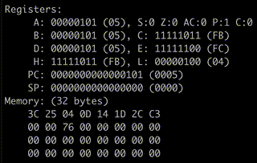

# Intel 8080 CPU emulator in Go

An Intel 8080 CPU emulator, written in Go.  This project uses [my Intel 8080 CPU assembler](https://github.com/lukepeterson/go8080assembler), especially for running tests.

## Features
- :white_check_mark: Registers
- :white_check_mark: Memory
- :white_check_mark: Fetch/decode/execute cycle
- :white_check_mark: [Assembler support](https://github.com/lukepeterson/go8080assembler)

## Instructions supported
- :white_check_mark: Move, load and store (84 instructions)
- :white_check_mark: Stack operations (13 instructions)
- :x: Jump (10 instructions)
- :x: Call (9 instructions)
- :x: Return (9 instructions)
- :x: Restart (8 instructions)
- :white_check_mark: Increment and decrement (22 instructions)
- :white_check_mark: Add (22 instructions)
- :white_check_mark: Subtract (18 instructions)
- :x: Logical (36 instructions)
- :x: Rotate (4 instructions)
- :x: Specials (4 instructions)
- :x: Input/output (2 instructions)
- :x: Control (4 instructions)

## TODO
- :x: Fix out-of-range errors when working at edge of 16-bit address space (POP H needs 0xFFFF+1 to work)
- :x: Force some `wantErr` errors in the CPU and detect them

# Running tests
Run `go test ./...`.
